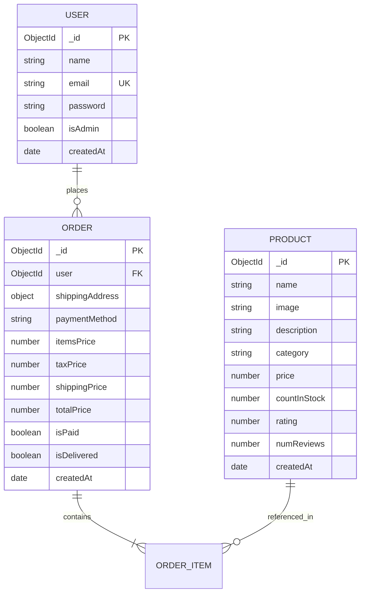

# 📋 Requirement Analysis Document (SRS)

## 📌 1. Project Overview & Objectives

### 1.1 Purpose
The purpose of this document is to define the functional and non-functional requirements for the **MERN Stack E-Commerce Platform**. This document serves as the Software Requirements Specification (SRS) outlining the architecture, features, user flows, system interfaces, and data models of the application.

### 1.2 Scope
The application is a full-stack, single-tenant E-Commerce platform designed to facilitate online product discovery, cart management, user authentication, and order processing. 

### 1.3 Target User Roles
1. **Guest User (Unauthenticated)**: Can view product listings, search/filter products, view product details, and add items to the cart.
2. **Registered Customer (Authenticated)**: Can log in, manage profile details, proceed through checkout, place orders, and view order history.
3. **System / Administrator**: Manages database seed data via CLI utilities and oversees data integrity.

---

## ⚙️ 2. Functional Requirements (FR)

### 👤 2.1 User Authentication & Account Management
* **FR-AUTH-01: User Registration**
  - The system shall allow new users to register by providing a full name, valid email address, and a secure password.
  - The backend shall validate unique email constraints and hash passwords using `bcryptjs` before persisting to MongoDB.
* **FR-AUTH-02: User Login & JWT Issuance**
  - The system shall authenticate users with email and password, returning a signed JSON Web Token (JWT) upon success.
* **FR-AUTH-03: Session Management**
  - The frontend shall store user information and JWT in `localStorage` and Redux state to maintain persistent sessions across page reloads.
* **FR-AUTH-04: Profile Retrieval**
  - Authenticated users shall be able to fetch their account details via a protected API route (`/api/users/profile`).

---

### 🛍️ 2.2 Product Catalog & Filtering System
* **FR-PROD-01: Product Listing & Pagination**
  - The system shall display a grid of available products with title, price, image, rating, review count, and stock status.
  - Products shall be paginated to optimize rendering performance.
* **FR-PROD-02: Search Functionality**
  - Users shall be able to perform keyword searches across product names and descriptions.
* **FR-PROD-03: Multi-Criteria Filtering**
  - Users shall be able to filter products by:
    - **Category** (e.g., Electronics, Clothing, Accessories)
    - **Price Range** (Dynamic slider from min to max price)
    - **Minimum Customer Rating** (1 to 5 stars)
* **FR-PROD-04: Product Sorting**
  - Users shall be able to sort listed products by:
    - Price (Low to High / High to Low)
    - Rating (Highest first)
    - Newest Additions
* **FR-PROD-05: Product Detail View**
  - The system shall render an individual product page displaying detailed descriptions, stock status, ratings, and quantity selector.

---

### 🛒 2.3 Shopping Cart System
* **FR-CART-01: Add to Cart**
  - Users shall be able to select a quantity and add products to the cart from the product detail page.
* **FR-CART-02: Cart Item Management**
  - Users shall be able to update item quantities or remove items directly within the cart view.
  - The quantity selector shall be constrained by the product's `countInStock` value.
* **FR-CART-03: Dynamic Price Calculation**
  - The cart shall automatically compute:
    - Items Subtotal
    - Tax Amount (e.g., 15%)
    - Shipping Fee (e.g., Free for orders over threshold, else standard rate)
    - Grand Total Price

---

### 💳 2.4 Checkout & Order Processing
* **FR-ORD-01: Checkout Access Control**
  - Unauthenticated users attempting to check out shall be redirected to the login/register view.
* **FR-ORD-02: Shipping Information Collection**
  - Users shall input shipping address details (Address, City, Postal Code, Country) during checkout.
* **FR-ORD-03: Payment Method Selection**
  - Users shall select a payment method (e.g., Cash on Delivery, PayPal, Credit Card).
* **FR-ORD-04: Order Creation**
  - The system shall submit order payload containing item breakdown, prices, shipping address, and payment method to `POST /api/orders`.
  - Upon creation, stock quantities shall be updated, and an order confirmation object returned.

---

### 📦 2.5 Order Management & Tracking
* **FR-HIST-01: User Order History**
  - Authenticated users shall be able to view a list of all their past orders with order ID, date, total price, payment status, and delivery status.
* **FR-HIST-02: Detailed Order Summary**
  - Users can view detailed breakdowns of individual past orders (`GET /api/orders/:id`).

---

### 🛡️ 2.6 Role-Based Access Control & Admin Management (RBAC)
* **FR-ADMIN-01: Admin Route Protection**
  - Backend API endpoints for administrative user, product, and order management shall be guarded by `admin` middleware checking `req.user.isAdmin`. Unauthorized users shall receive HTTP 401/403 errors.
  - Frontend routes under `/admin/*` shall be guarded by `AdminRoute.jsx` component, redirecting non-admin users to `/login`.
* **FR-ADMIN-02: User Account Administration**
  - Administrators shall be able to view a list of all registered users (`UserListPage.jsx`), promote/demote user Admin permissions (`PUT /api/users/:id`), and delete accounts (`DELETE /api/users/:id`).
* **FR-ADMIN-03: Product Catalog Administration**
  - Administrators shall be able to create new store products (`POST /api/products`), update product details and stock (`PUT /api/products/:id`), and remove products (`DELETE /api/products/:id`).
* **FR-ADMIN-04: System Order Fulfillment**
  - Administrators shall be able to view all system customer orders (`OrderListPage.jsx`) and mark orders as delivered (`PUT /api/orders/:id/deliver`).

---

### 🛠️ 2.7 Database Seeder CLI Utility
* **FR-SEED-01: Batch Import / Destroy Data**
  - Developers can execute CLI scripts (`npm run data:import` and `npm run data:destroy`) to seed or wipe MongoDB database collections.

---

## 🔒 3. Non-Functional Requirements (NFR)

### 3.1 Security Requirements
* **NFR-SEC-01 (Password Encryption)**: Passwords must be hashed using `bcryptjs` with a minimum salt factor of 10.
* **NFR-SEC-02 (Stateless Authentication)**: Sensitive endpoints require a HTTP `Authorization: Bearer <JWT>` header verified by `authMiddleware.js`.
* **NFR-SEC-03 (Sanitization)**: Database queries must use Mongoose ORM models to prevent NoSQL injection.
* **NFR-SEC-04 (Environment Isolation)**: Secret keys (`JWT_SECRET`, `MONGO_URI`) must be stored in `.env` configuration files and excluded from version control.

### 3.2 Performance Requirements
* **NFR-PERF-01 (API Latency)**: Database queries and API endpoint responses should complete within 200ms under standard loads.
* **NFR-PERF-02 (Frontend Bundling)**: Frontend assets must be optimized using Vite to ensure fast initial page loads.

### 3.3 Usability & Interface Design
* **NFR-USA-01 (Responsive Design)**: The UI must adapt seamlessly across desktop (1024px+), tablet (768px - 1023px), and mobile (<767px) screens.
* **NFR-USA-02 (User Feedback)**: Visual feedback (spinners, alert messages, toast notifications) must be provided during API loading and error states.

### 3.4 Reliability & Maintainability
* **NFR-REL-01 (Error Handling)**: Centralized Express error middleware (`errorMiddleware.js`) must intercept unexpected exceptions and 404 routes, returning clean JSON error responses `{ message: "..." }`.
* **NFR-MAINT-01 (Modular Architecture)**: Codebase must adhere to clean separation of concerns (MVC pattern in Backend, Component-driven Redux architecture in Frontend).

---

## 📊 4. Data Requirements & Schemas

### 4.1 Data Models Overview

---

## ⚡ 5. Hardware & System Constraints

| Layer | Component | Requirement |
| :--- | :--- | :--- |
| **Runtime** | Node.js | v16.0.0 or higher |
| **Database** | MongoDB | v5.0.0 or higher / MongoDB Atlas |
| **Frontend Runtime** | Modern Browser | Chrome, Firefox, Safari, Edge (ES6+ support) |
| **Development OS** | Operating System | Windows, macOS, Linux |

---

## 🎯 6. Traceability Matrix

| Requirement ID | Backend Endpoint | Frontend Component / Page |
| :--- | :--- | :--- |
| **FR-AUTH-01/02** | `POST /api/users/register`, `POST /api/users/login` | `RegisterPage.jsx`, `LoginPage.jsx`, `authSlice.js` |
| **FR-PROD-01..04**| `GET /api/products` | `HomePage.jsx`, `Filters.jsx`, `Pagination.jsx`, `productSlice.js` |
| **FR-PROD-05**    | `GET /api/products/:id` | `ProductDetailPage.jsx` |
| **FR-CART-01..03**| Client-side Redux | `CartPage.jsx`, `cartSlice.js` |
| **FR-ORD-01..04** | `POST /api/orders` | `CheckoutPage.jsx`, `orderSlice.js` |
| **FR-HIST-01..02**| `GET /api/orders/myorders`, `GET /api/orders/:id` | `OrderHistoryPage.jsx`, `OrderDetailsPage.jsx` |
| **FR-ADMIN-01..04**| `/api/users/*`, `/api/products/*`, `/api/orders/*` | `AdminRoute.jsx`, `UserListPage.jsx`, `ProductListPage.jsx`, `OrderListPage.jsx` |
